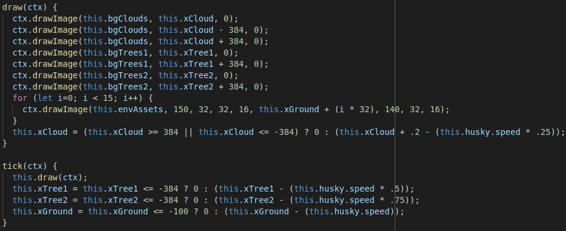
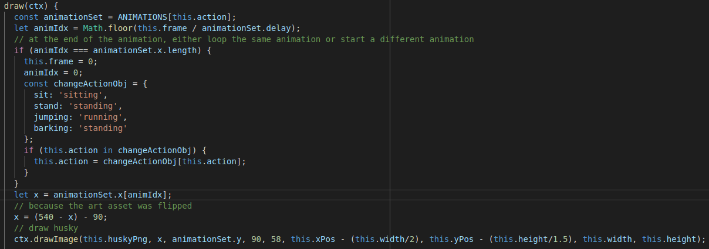
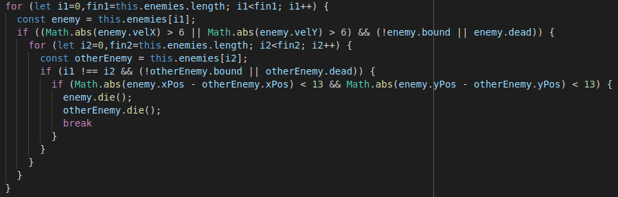

# Husky Adventure

[See it on Firebase](https://husky-scroller.firebaseapp.com/)

## Overview
Sidescroller where a psychic husky defeats enemies

## Technologies
* Javascript
* HTML5 Canvas
* Webpack
* Firebase hosting

## How to Play
* enter: play / pause.
* m: mute / unmute
* w: jump (must be running), hold to jump higher
* a: bark and blow back enemies (must be standing)
* s: sit (must be standing)
* d: run
* space: increase energy (more energy while sitting).
* ijkl: move energy
* left shift: grab enemies near the energy
* right shift: release held enemies
* enemies die from hard impacts

## Code Snippets

Different parts of the background scroll left at different speeds when the husky moves to the right. The clouds scroll right by default.

The husky is animated differently depending on its current action. At the end of an animation, the animation either loops or switches to a different one.

If a living, unbound enemy is moving at a high and collides with another enemy, both enemies die.

## Credits
#### Audio
* Radio Etalia from Chance de la Soul on opengameart.org
* Dog Whine from Partners in Rhyme on freesoundeffects.com
* Dog Bark from Partners in Rhyme on freesoundeffects.com
* Enemy Death from rubberduck on opengameart.org
#### Images
* Husky from Hellkipz and Shepardskin on opengameart.org
* Background from Anokolisa on itch.io
* Bat from bagzie on opengameart.org
* Skeleton from Stephen Challener (Redshrike) on opengameart.org
* Magic from Cethiel on opengameart.org

